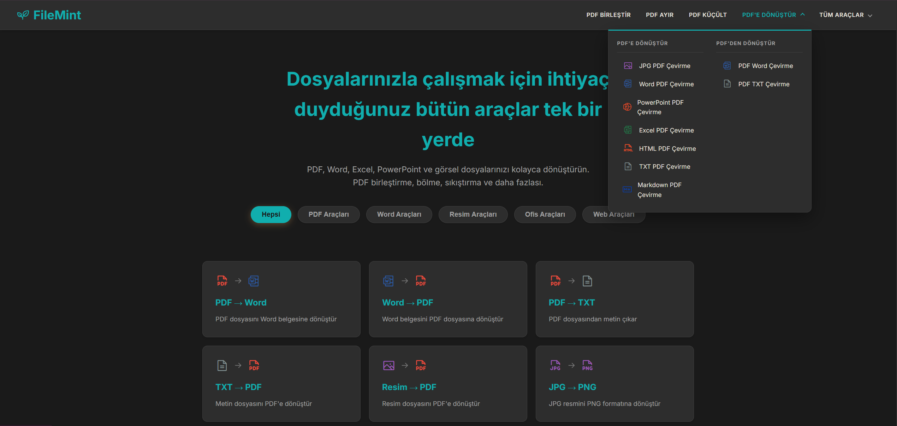
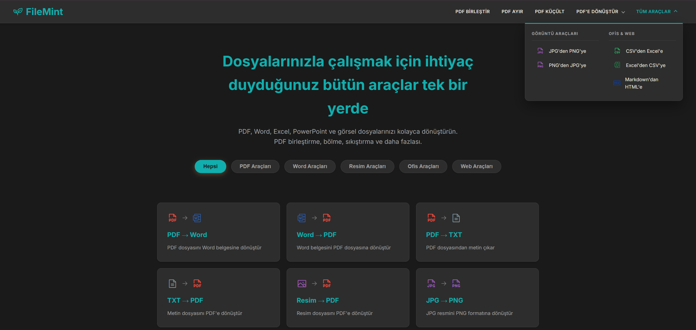
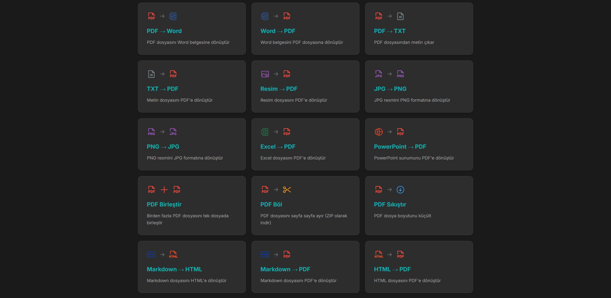
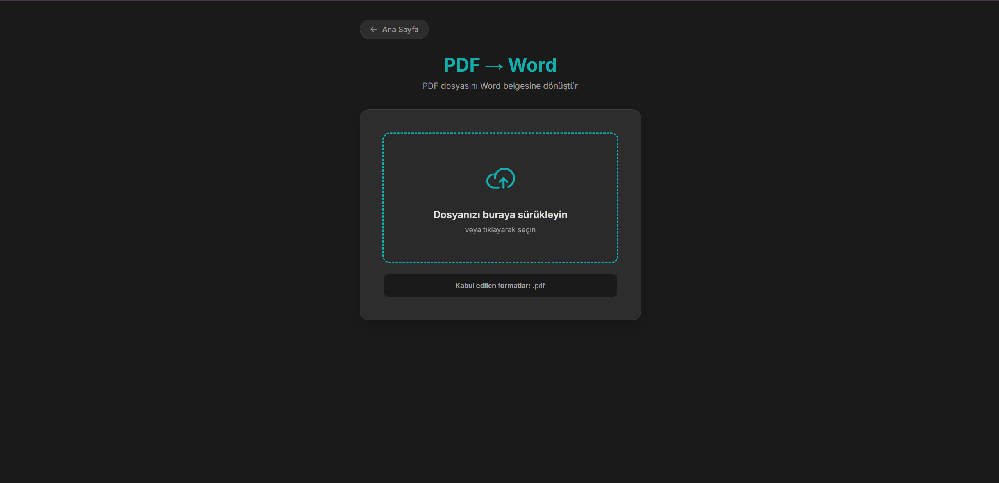

# 🌿 FileMint — Çoklu Format Dosya Dönüştürücü

<p align="center">
  <a href="https://www.python.org/">
    
  </a>
  <a href="https://flask.palletsprojects.com/">
    
  </a>
  <a href="https://pymupdf.readthedocs.io/">
    
  </a>
  <a href="#">
    
  </a>
</p>

> **FileMint**, PDF, Word, Excel, PowerPoint, resim ve daha birçok dosya formatı arasında hızlı ve güvenli dönüşüm yapmanızı sağlayan modern bir web uygulamasıdır. Sürükle-bırak arayüzü ile dosyalarınızı saniyeler içinde dönüştürün.

## 📋 Proje Hakkında

**FileMint**; dosya dönüştürme işlemlerini kolaylaştırmak için tasarlanmış, Python tabanlı güçlü bir araçtır. Kullanıcı dostu web arayüzü sayesinde karmaşık dönüşüm işlemlerini tek tıkla gerçekleştirebilirsiniz.

- **Backend**: Flask + Python
- **PDF İşlemleri**: PyMuPDF, PyPDF2, pdf2docx
- **Ofis Dosyaları**: python-docx, openpyxl, pandas
- **Özellikler**: 
  - 20+ farklı dönüşüm türü
  - Sürükle-bırak dosya yükleme
  - Toplu PDF birleştirme
  - PDF sıkıştırma ve bölme

## 🖼️ Ekran Görüntüleri

### 1. Ana Sayfa
Modern ve şık tasarımlı ana sayfa ile tüm dönüşüm araçlarına kolayca erişin.

<p align="center">
  <br/>
  <em>FileMint Ana Sayfa</em>
</p>

### 2. Dönüşüm Araçları
Kategorilere ayrılmış dönüşüm seçenekleri ile ihtiyacınız olan aracı hızlıca bulun.

<p align="center">
  
  
  <br/>
  <em>Dönüşüm Kategorileri ve Araçlar</em>
</p>

### 3. Dosya Dönüştürme Arayüzü
Sürükle-bırak özellikli dosya yükleme alanı ile dosyalarınızı kolayca dönüştürün.

<p align="center">
  <br/>
  <em>Sürükle-Bırak Dönüşüm Arayüzü</em>
</p>

## 🛠️ Desteklenen Dönüşümler

### Belge Dönüşümleri

| Dönüşüm | Açıklama |
|---------|----------|
| **PDF → Word** | PDF dosyasını düzenlenebilir Word belgesine dönüştür |
| **Word → PDF** | Word belgesini PDF formatına dönüştür |
| **PDF → TXT** | PDF dosyasından metin çıkar |
| **TXT → PDF** | Metin dosyasını PDF'e dönüştür |
| **Markdown → HTML** | Markdown dosyasını HTML'e dönüştür |
| **Markdown → PDF** | Markdown dosyasını PDF'e dönüştür |
| **HTML → PDF** | HTML dosyasını PDF'e dönüştür |

### Tablo Dönüşümleri

| Dönüşüm | Açıklama |
|---------|----------|
| **Excel → PDF** | Excel tablosunu PDF'e dönüştür |
| **Excel → CSV** | Excel dosyasını CSV formatına dönüştür |
| **CSV → Excel** | CSV dosyasını Excel formatına dönüştür |

### Resim Dönüşümleri

| Dönüşüm | Açıklama |
|---------|----------|
| **Resim → PDF** | JPG/PNG resmini PDF'e dönüştür |
| **JPG → PNG** | JPG resmini PNG formatına dönüştür |
| **PNG → JPG** | PNG resmini JPG formatına dönüştür |

### PDF Araçları

| Araç | Açıklama |
|------|----------|
| **PDF Birleştir** | Birden fazla PDF'i tek dosyada birleştir |
| **PDF Böl** | PDF'i sayfa sayfa ayır (ZIP olarak indir) |
| **PDF Sıkıştır** | PDF dosya boyutunu küçült |

### Sunum Dönüşümleri

| Dönüşüm | Açıklama |
|---------|----------|
| **PowerPoint → PDF** | Sunumu PDF formatına dönüştür |

## 🛠️ Kullanılan Teknolojiler

### Backend & Core

| Teknoloji | Açıklama |
|-----------|----------|
| **Python 3.10+** | Ana programlama dili |
| **Flask** | Hafif ve güçlü web framework |
| **PyMuPDF (fitz)** | Gelişmiş PDF işleme kütüphanesi |
| **PyPDF2** | PDF okuma ve yazma |
| **pdf2docx** | PDF'den Word'e dönüştürme |

### Ofis Dosyaları

| Teknoloji | Açıklama |
|-----------|----------|
| **python-docx** | Word dosyası oluşturma ve düzenleme |
| **openpyxl** | Excel dosyası işleme |
| **pandas** | Veri manipülasyonu ve CSV/Excel dönüşümü |

### Diğer

| Teknoloji | Açıklama |
|-----------|----------|
| **Pillow** | Resim işleme ve format dönüşümü |
| **WeasyPrint** | HTML'den PDF oluşturma |
| **Markdown** | Markdown işleme |
| **Pygments** | Kod renklendirme |

## 🚀 Kurulum

Projeyi kendi bilgisayarınızda çalıştırmak için aşağıdaki adımları izleyin.

### 1. Repoyu Klonlayın
```bash
git clone https://github.com/BurakYucelPY/FileMint.git
cd FileMint
```

### 2. Sanal Ortam Oluşturun (Önerilir)
```bash
# Windows
python -m venv venv
.\venv\Scripts\activate

# macOS/Linux
python3 -m venv venv
source venv/bin/activate
```

### 3. Bağımlılıkları Yükleyin
```bash
pip install -r requirements.txt
```

### 4. Uygulamayı Başlatın
```bash
cd web
python app.py
```

Tarayıcınızda `http://localhost:5000` adresine gidin.

## 📁 Proje Yapısı

```
FileMint/
├─ main.py                      # CLI giriş noktası (test amaçlı)
├─ requirements.txt             # Python bağımlılıkları
├─ donusum/                     # Dönüşüm modülleri
│  ├─ word_to_pdf.py            # Word → PDF
│  ├─ pdf_to_word.py            # PDF → Word
│  ├─ pdf_to_txt.py             # PDF → TXT
│  ├─ txt_to_pdf.py             # TXT → PDF
│  ├─ image_to_pdf.py           # Resim → PDF
│  ├─ image_converter.py        # JPG ↔ PNG
│  ├─ excel_to_pdf.py           # Excel → PDF
│  ├─ csv_excel_converter.py    # CSV ↔ Excel
│  ├─ powerpoint_to_pdf.py      # PowerPoint → PDF
│  ├─ pdf_merge.py              # PDF Birleştirme
│  ├─ pdf_split.py              # PDF Bölme
│  ├─ pdf_compress.py           # PDF Sıkıştırma
│  ├─ markdown_converter.py     # Markdown → HTML/PDF
│  └─ html_to_pdf.py            # HTML → PDF
├─ web/                         # Web Uygulaması
│  ├─ app.py                    # Flask uygulaması
│  └─ templates/                # HTML şablonları
│     ├─ index.html             # Ana sayfa
│     └─ convert.html           # Dönüşüm sayfası
├─ readMeImage/                 # README görselleri
└─ README.md                    # Proje dokümantasyonu
```

## 💡 Nasıl Çalışır?

1.  **Dosya Seçimi:** Kullanıcı dönüştürmek istediği dosyayı sürükle-bırak veya dosya seçici ile yükler.
2.  **Format Belirleme:** Sistem, dosya uzantısını kontrol eder ve uygun dönüştürücüyü seçer.
3.  **Dönüşüm İşlemi:** İlgili Python modülü çağrılarak dosya dönüştürülür.
4.  **İndirme:** Dönüştürülen dosya kullanıcıya otomatik olarak indirilir.

## 🐛 Sorun Giderme

| Sorun | Çözüm |
|-------|-------|
| **WeasyPrint Kurulum Hatası** | Windows'ta GTK kurulumu gerekebilir. [WeasyPrint Docs](https://doc.courtbouillon.org/weasyprint/stable/first_steps.html) adresinden detaylı bilgi alabilirsiniz. |
| **PDF Dönüşümü Başarısız** | Dosyanın bozuk veya şifreli olmadığından emin olun. |
| **Büyük Dosya Hatası** | Varsayılan limit 50 MB'tır. `app.py` dosyasındaki `MAX_CONTENT_LENGTH` değerini artırabilirsiniz. |
| **Modül Bulunamadı** | Sanal ortamın aktif olduğundan ve tüm bağımlılıkların yüklendiğinden emin olun. |
| **Port Kullanımda** | `app.py` dosyasında farklı bir port belirleyebilirsiniz: `app.run(port=5001)` |

---
<p align="center">
  Made with ❤️ by <a href="https://github.com/BurakYucelPY">Burak Yücel</a>
</p>
